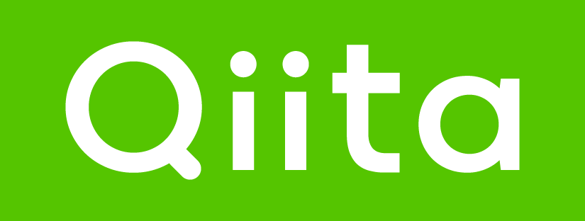

# Hi there 👋
#  **About Me :**

```yaml
名前: 清水 透真
居住地: 愛知, 日本
職業: 大学院生
学んでいること: ["Next", "Go", "DeepLearning"]
趣味: ["お菓子作り", "喫茶店巡り"]
コミュニティ: ["IdeaxTech", "TECH AiCHI"]
```
###  and  and Latest articles:

- [【インターン】DATUM STUDIOの1dayインターンに参加して](https://note.com/tomas_0124/n/na662a16832e8)
- [【インターン】DMM GUILD2025](https://note.com/tomas_0124/n/nb352c535b296)
- [【コミュニティ】Idea×Techとは](https://note.com/tomas_0124/n/n700650938797)
- [【Rust + AWS】RustでAWS Rekognitionを扱う](https://zenn.dev/tomas_engineer/books/fa87f772066079)
- [【Unity】UnityでHTTP通信を行うには](https://qiita.com/thomas0124/items/7b53912544a82a55b7ec)

<picture>
  <source media="(prefers-color-scheme: dark)" srcset="https://raw.githubusercontent.com/obregonia1/obregonia1/master/img/snake-dark.svg">
  <source media="(prefers-color-scheme: light)" srcset="https://raw.githubusercontent.com/obregonia1/obregonia1/master/img/snake.svg">
  
</picture>

<!--
**thomas0124/thomas0124** is a ✨ _special_ ✨ repository because its `README.md` (this file) appears on your GitHub profile.

Here are some ideas to get you started:

- 🔭 I’m currently working on ...
- 🌱 I’m currently learning ...
- 👯 I’m looking to collaborate on ...
- 🤔 I’m looking for help with ...
- 💬 Ask me about ...
- 📫 How to reach me: ...
- 😄 Pronouns: ...
- ⚡ Fun fact: ...
-->


